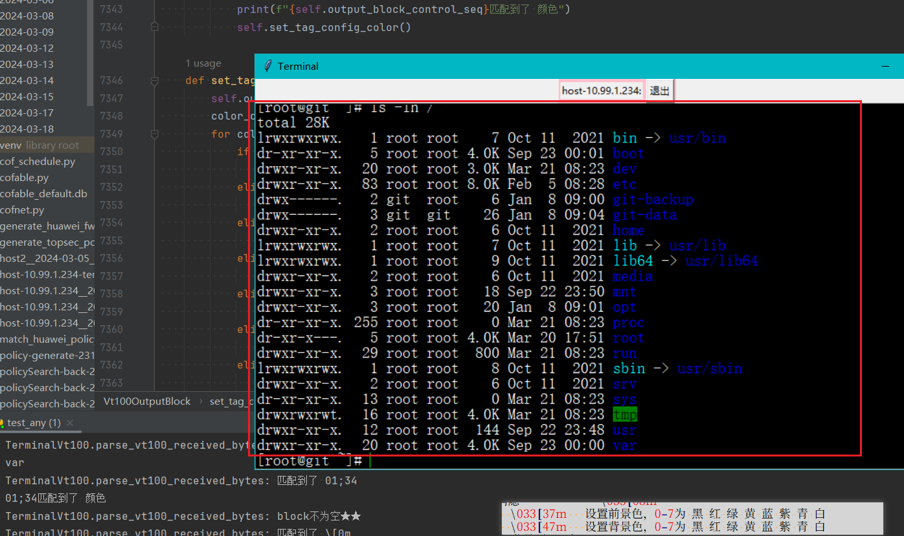

# cofable
A graphical operation and maintenance inspection tool<br>
面向个人的可视化运维巡检工具，个人运维工具中的 瑞士军刀 ，无需安装，开箱即用！<br>
目前基础功能已开发完成，基本可用，高级功能还在开发中<br>
大概功能构想为：<br>
创建一个项目，在项目里创建资源，再创建巡检模板，模板里可选择目标主机/主机组，选择要执行的巡检命令或操作，可定时执行，执行完成后可发邮件通知<br>
以及在线批量shell交互，shell终端支持彩色及自定义单词/字符高亮<br>
How to run it? 如何运行此程序？<br>
```shell
python3 cofable.py
```
效果图：<br>

<br>
支持在线批量shell交互，shell终端支持彩色及自定义单词/字符高亮<br>

